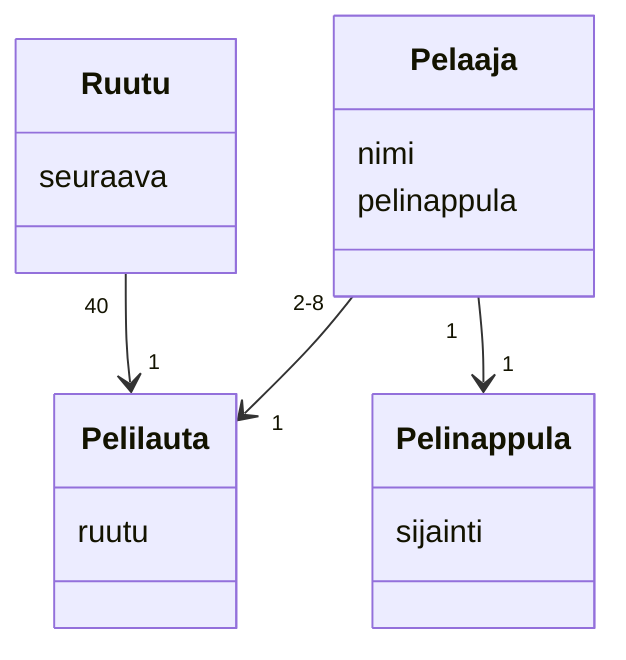

```mermaid
 classDiagram
      Pelaaja "2-8" --> "1" Pelilauta
      Ruutu "40" --> "1" Pelilauta
      Pelaaja "1" --> "1" Pelinappula
      class Pelaaja{
          nimi
          pelinappula
      }

      class Pelilauta{
          ruutu
      }

      class Ruutu{
          seuraava
      }

      class Pelinappula{
          sijainti
      }
```
